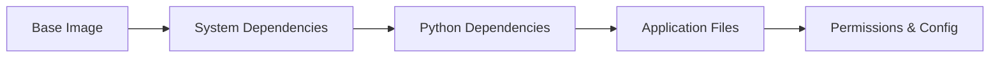

# Modular ComfyUI Docker Environment - Implementation Plan

## Executive Summary

This document provides a comprehensive implementation plan for creating a production-ready Docker image based on `runpod/comfyui` with modular feature installation, real-time log streaming, and automated CI/CD publishing to GitHub Container Registry (GHCR).

---

## 1. Current State Analysis

### 1.1 Existing Files

| File | Status | Notes |
|------|--------|-------|
| [`project_requirements.md`](../project_requirements.md) | ✅ Complete | Requirements specification |
| [`setup_wan.sh`](../setup_wan.sh) | ✅ Pre-tested | Wan 2.2 downloads - DO NOT MODIFY |
| [`setup_parallel.sh`](../setup_parallel.sh) | ✅ Pre-tested | Wan 2.1 + Infinite Talk - DO NOT MODIFY |
| [`log_server.py`](../log_server.py) | ⚠️ Needs Improvement | Flask app with multiple issues |
| `Dockerfile` | ❌ Missing | Needs to be created |
| `entrypoint.sh` | ❌ Missing | Needs to be created |
| `.github/workflows/publish.yml` | ❌ Missing | Needs to be created |

### 1.2 Flask Application Issues Analysis

The current [`log_server.py`](../log_server.py:1) has the following issues:

#### Critical Issues

1. **No Error Handling** (Lines 81-96)
   - No try-catch blocks around file operations
   - No handling for file permission errors
   - No handling for disk full scenarios

2. **No Input Validation**
   - No rate limiting on endpoints
   - No request size limits

3. **No Logging**
   - Application errors are not logged
   - No request logging for debugging

4. **Security Concerns**
   - Running Flask development server in production (Line 100)
   - No CORS configuration
   - No security headers

5. **Resource Management**
   - Infinite loop in [`generate()`](../log_server.py:81) function without proper cleanup
   - No connection timeout handling
   - File handle may not be properly closed on client disconnect

#### Code Quality Issues

6. **No Health Check Endpoint**
   - Required for container orchestration and RunPod health monitoring

7. **No Graceful Shutdown**
   - No signal handling for SIGTERM/SIGINT

8. **Hardcoded Configuration**
   - Log file path hardcoded (Line 7)
   - Port hardcoded (Line 100)
   - Should use environment variables

9. **No Type Hints**
   - Missing Python type annotations

10. **Missing Documentation**
    - No docstrings
    - No API documentation

---

## 2. Architecture Overview

```mermaid
flowchart TB
    subgraph Container[Docker Container]
        subgraph Entrypoint[entrypoint.sh]
            A[Start Log Server] --> B{Check ENABLE_FEATURES}
            B -->|wan2.1| C[Run setup_parallel.sh]
            B -->|wan2.2| D[Run setup_wan.sh]
            C --> E[Start ComfyUI]
            D --> E
            B -->|none| E
        end
        
        subgraph Services[Running Services]
            F[Flask Log Server :8001]
            G[ComfyUI :8188]
        end
        
        E --> G
        A --> F
    end
    
    subgraph External[External Access]
        H[User Browser] --> F
        H --> G
    end
    
    subgraph Storage[Persistent Storage]
        I[/workspace/runpod-slim/ComfyUI]
        J[/tmp/comfyui.log]
    end
    
    G --> I
    F --> J
```

---

## 3. Detailed Implementation Plan

### 3.1 Corrected Flask Application

#### File Structure
```
log_server.py          # Main application (single file as per requirements)
```

#### Key Improvements

| Feature | Implementation |
|---------|----------------|
| Error Handling | Try-except blocks with proper logging |
| Input Validation | Request validation middleware |
| Logging | Python logging module with structured output |
| Health Check | `/health` endpoint for container orchestration |
| Graceful Shutdown | Signal handlers for SIGTERM/SIGINT |
| Configuration | Environment variables with defaults |
| Security | Security headers, CORS configuration |
| Production Server | Gunicorn or Waitress (optional, Flask threaded mode acceptable for this use case) |

#### Proposed Code Structure

```python
# Configuration via environment variables
LOG_FILE = os.environ.get('LOG_FILE_PATH', '/tmp/comfyui.log')
PORT = int(os.environ.get('LOG_SERVER_PORT', '8001'))
HOST = os.environ.get('LOG_SERVER_HOST', '0.0.0.0')

# Endpoints
GET /           - Web UI for log viewing
GET /stream     - SSE stream of log content
GET /health     - Health check endpoint
GET /api/logs   - JSON API for log retrieval (optional)
```

---

### 3.2 Dockerfile Design

#### Base Image
```dockerfile
FROM runpod/comfyui:latest
```
> **Note:** Using the `latest` tag for flexibility. For production deployments requiring strict reproducibility, pin to a specific SHA256 digest.

#### Layer Optimization Strategy



#### Security Hardening Measures

| Measure | Implementation |
|---------|----------------|
| Non-root User | Create and use `comfyui` user where possible |
| Minimal Packages | Only install required dependencies |
| No Secrets in Image | Use runtime environment variables |
| Read-only Filesystem | Where applicable |
| Security Updates | Update base packages |

#### Proposed Dockerfile Structure

```dockerfile
# Stage 1: Base with dependencies
FROM runpod/comfyui@sha256:... AS base

# Install system dependencies (cached layer)
RUN apt-get update && apt-get install -y --no-install-recommends \
    aria2 \
    && rm -rf /var/lib/apt/lists/*

# Install Python dependencies (cached layer)
RUN pip install --no-cache-dir flask gunicorn

# Stage 2: Application
FROM base AS application

# Copy application files
COPY --chmod=755 setup_wan.sh /workspace/
COPY --chmod=755 setup_parallel.sh /workspace/
COPY --chmod=755 entrypoint.sh /workspace/
COPY log_server.py /workspace/

# Expose ports
EXPOSE 8188 8001

# Set entrypoint
ENTRYPOINT ["/workspace/entrypoint.sh"]
```

---

### 3.3 Entrypoint Script Design

#### Flow Diagram


#### Key Features

1. **Log File Initialization** - Create log file if not exists
2. **Background Log Server** - Start Flask app in background
3. **Feature Detection** - Parse `ENABLE_FEATURES` environment variable
4. **Sequential Execution** - Run setup scripts in order
5. **Single ComfyUI Start** - Only start ComfyUI once after all setup
6. **Error Handling** - Log errors and continue where possible

---

### 3.4 GitHub Actions Workflow

#### Workflow Triggers

| Trigger | Action |
|---------|--------|
| Push to `main` | Build and publish `latest` tag |
| Pull Request | Build only (no publish) |
| Manual Dispatch | Build and publish with custom tag |

#### Workflow Diagram


#### Image Naming Convention

```
ghcr.io/{owner}/comfyui-modular:latest
ghcr.io/{owner}/comfyui-modular:{sha}
ghcr.io/{owner}/comfyui-modular:{tag}
```

---

## 4. Assumptions

### 4.1 Runtime Environment

| Assumption | Details |
|------------|---------|
| Base Image | `runpod/comfyui` contains Python 3.x, pip, and ComfyUI pre-installed |
| ComfyUI Location | Located at `/workspace/runpod-slim/ComfyUI` |
| Network Access | Container has internet access for model downloads |
| Storage | `/workspace` is persistent storage on RunPod |
| GPU | NVIDIA GPU available with CUDA support |

### 4.2 Dependencies

| Dependency | Version | Purpose |
|------------|---------|---------|
| Python | 3.8+ | Runtime for Flask and ComfyUI |
| Flask | Latest | Log streaming server |
| aria2 | Latest | High-speed parallel downloads |
| git | Pre-installed | Clone custom nodes |

### 4.3 Configuration

| Variable | Default | Description |
|----------|---------|-------------|
| `ENABLE_FEATURES` | `""` | Comma-separated list: `wan2.1`, `wan2.2` |
| `LOG_FILE_PATH` | `/tmp/comfyui.log` | Path to log file |
| `LOG_SERVER_PORT` | `8001` | Port for log server |

---

## 5. File Specifications

### 5.1 log_server.py (Corrected)

```python
#!/usr/bin/env python3
"""
ComfyUI Live Log Streaming Server

A production-ready Flask application for real-time log viewing.
Provides web UI and streaming API for monitoring ComfyUI logs.
"""

import os
import sys
import signal
import logging
from typing import Generator
from flask import Flask, Response, render_template_string, jsonify

# Configuration from environment variables
LOG_FILE: str = os.environ.get('LOG_FILE_PATH', '/tmp/comfyui.log')
PORT: int = int(os.environ.get('LOG_SERVER_PORT', '8001'))
HOST: str = os.environ.get('LOG_SERVER_HOST', '0.0.0.0')
DEBUG: bool = os.environ.get('LOG_SERVER_DEBUG', 'false').lower() == 'true'

# Configure logging
logging.basicConfig(
    level=logging.INFO,
    format='%(asctime)s - %(name)s - %(levelname)s - %(message)s',
    handlers=[logging.StreamHandler(sys.stdout)]
)
logger = logging.getLogger(__name__)

app = Flask(__name__)

# HTML Template (unchanged from original - good design)
HTML_TEMPLATE = """..."""  # Keep existing template

def ensure_log_file_exists() -> None:
    """Create log file if it doesn't exist."""
    try:
        if not os.path.exists(LOG_FILE):
            os.makedirs(os.path.dirname(LOG_FILE), exist_ok=True)
            with open(LOG_FILE, 'w') as f:
                f.write("--- [SYSTEM] Waiting for logs... ---\n")
            logger.info(f"Created log file: {LOG_FILE}")
    except (IOError, OSError) as e:
        logger.error(f"Failed to create log file: {e}")

@app.route('/')
def index() -> str:
    """Serve the log viewer web interface."""
    return render_template_string(HTML_TEMPLATE)

@app.route('/stream')
def stream() -> Response:
    """Stream log file content in real-time."""
    def generate() -> Generator[str, None, None]:
        try:
            ensure_log_file_exists()
            with open(LOG_FILE, 'r') as f:
                while True:
                    line = f.readline()
                    if not line:
                        import time
                        time.sleep(0.5)
                        continue
                    yield line
        except GeneratorExit:
            logger.info("Client disconnected from stream")
        except Exception as e:
            logger.error(f"Stream error: {e}")
            yield f"--- [ERROR] Stream error: {e} ---\n"
    
    return Response(
        generate(),
        mimetype='text/plain',
        headers={
            'Cache-Control': 'no-cache',
            'X-Accel-Buffering': 'no'
        }
    )

@app.route('/health')
def health() -> tuple:
    """Health check endpoint for container orchestration."""
    try:
        log_exists = os.path.exists(LOG_FILE)
        return jsonify({
            'status': 'healthy',
            'log_file_exists': log_exists,
            'log_file_path': LOG_FILE
        }), 200
    except Exception as e:
        return jsonify({
            'status': 'unhealthy',
            'error': str(e)
        }), 500

def signal_handler(signum: int, frame) -> None:
    """Handle shutdown signals gracefully."""
    logger.info(f"Received signal {signum}, shutting down...")
    sys.exit(0)

if __name__ == '__main__':
    signal.signal(signal.SIGTERM, signal_handler)
    signal.signal(signal.SIGINT, signal_handler)
    
    logger.info(f"Starting log server on {HOST}:{PORT}")
    logger.info(f"Monitoring log file: {LOG_FILE}")
    
    app.run(host=HOST, port=PORT, threaded=True, debug=DEBUG)
```

### 5.2 Dockerfile

```dockerfile
# =============================================================================
# Modular ComfyUI Docker Image
# =============================================================================
# Base: runpod/comfyui with selective feature installation
# Features: Wan 2.1, Wan 2.2, Real-time log streaming
# =============================================================================

# Use latest tag for flexibility (pin to SHA for strict reproducibility)
FROM runpod/comfyui:latest AS base

# Metadata
LABEL org.opencontainers.image.title="ComfyUI Modular"
LABEL org.opencontainers.image.description="Modular ComfyUI with selective feature installation"
LABEL org.opencontainers.image.source="https://github.com/OWNER/REPO"
LABEL org.opencontainers.image.licenses="MIT"

# Environment variables
ENV PYTHONUNBUFFERED=1 \
    PYTHONDONTWRITEBYTECODE=1 \
    PIP_NO_CACHE_DIR=1 \
    PIP_DISABLE_PIP_VERSION_CHECK=1 \
    ENABLE_FEATURES="" \
    LOG_FILE_PATH="/tmp/comfyui.log" \
    LOG_SERVER_PORT="8001"

# Install system dependencies
# Using --no-install-recommends to minimize image size
RUN apt-get update && apt-get install -y --no-install-recommends \
    aria2 \
    && apt-get clean \
    && rm -rf /var/lib/apt/lists/* /tmp/* /var/tmp/*

# Install Python dependencies
RUN pip install --no-cache-dir \
    flask>=2.0.0

# Create workspace directory if not exists
RUN mkdir -p /workspace

# Copy setup scripts (pre-tested, do not modify)
COPY setup_wan.sh /workspace/setup_wan.sh
COPY setup_parallel.sh /workspace/setup_parallel.sh

# Copy application files
COPY log_server.py /workspace/log_server.py
COPY entrypoint.sh /workspace/entrypoint.sh

# Set permissions
RUN chmod +x /workspace/setup_wan.sh \
    && chmod +x /workspace/setup_parallel.sh \
    && chmod +x /workspace/entrypoint.sh \
    && chmod +x /workspace/log_server.py

# Create log file directory and set permissions
RUN mkdir -p /tmp && touch /tmp/comfyui.log

# Expose ports
# 8188: ComfyUI web interface
# 8001: Log streaming server
EXPOSE 8188 8001

# Health check
HEALTHCHECK --interval=30s --timeout=10s --start-period=60s --retries=3 \
    CMD curl -f http://localhost:8001/health || exit 1

# Set working directory
WORKDIR /workspace

# Entrypoint
ENTRYPOINT ["/workspace/entrypoint.sh"]
```

### 5.3 entrypoint.sh

```bash
#!/bin/bash
# =============================================================================
# ComfyUI Modular Entrypoint Script
# =============================================================================
# Handles feature-based initialization and service startup
# =============================================================================

set -e  # Exit on error

# Configuration
LOG_FILE="${LOG_FILE_PATH:-/tmp/comfyui.log}"
COMFY_PATH="/workspace/runpod-slim/ComfyUI"

# Initialize log file
echo "--- [SYSTEM] Container Started at $(date -Iseconds) ---" > "$LOG_FILE"
echo "--- [SYSTEM] Features Enabled: ${ENABLE_FEATURES:-none} ---" >> "$LOG_FILE"

# Start the Live Log Server in the background
echo "--- [SYSTEM] Starting Log Server on port ${LOG_SERVER_PORT:-8001} ---" >> "$LOG_FILE"
python3 /workspace/log_server.py > /tmp/log_server_status.log 2>&1 &
LOG_SERVER_PID=$!
echo "--- [SYSTEM] Log Server PID: $LOG_SERVER_PID ---" >> "$LOG_FILE"

# Wait for log server to start
sleep 2

# Conditional Feature Execution
if [[ "${ENABLE_FEATURES}" == *"wan2.1"* ]]; then
    echo "--- [PROCESS] Starting Wan 2.1 Setup ---" >> "$LOG_FILE"
    bash /workspace/setup_parallel.sh >> "$LOG_FILE" 2>&1 || {
        echo "--- [ERROR] Wan 2.1 setup failed ---" >> "$LOG_FILE"
    }
    echo "--- [PROCESS] Wan 2.1 Setup Complete ---" >> "$LOG_FILE"
fi

if [[ "${ENABLE_FEATURES}" == *"wan2.2"* ]]; then
    echo "--- [PROCESS] Starting Wan 2.2 Setup ---" >> "$LOG_FILE"
    bash /workspace/setup_wan.sh >> "$LOG_FILE" 2>&1 || {
        echo "--- [ERROR] Wan 2.2 setup failed ---" >> "$LOG_FILE"
    }
    echo "--- [PROCESS] Wan 2.2 Setup Complete ---" >> "$LOG_FILE"
fi

# Kill any existing ComfyUI processes (from setup scripts)
pkill -f "python3 main.py" || true
sleep 2

# Start ComfyUI (Only once, after all downloads finish)
echo "--- [SYSTEM] Starting ComfyUI ---" >> "$LOG_FILE"
cd "$COMFY_PATH"
exec python3 main.py --listen 0.0.0.0 --port 8188 >> "$LOG_FILE" 2>&1
```

### 5.4 .github/workflows/publish.yml

```yaml
# =============================================================================
# GitHub Actions Workflow: Build and Publish to GHCR
# =============================================================================
name: Build and Publish Docker Image

on:
  push:
    branches:
      - main
      - master
    tags:
      - 'v*'
  pull_request:
    branches:
      - main
      - master
  workflow_dispatch:
    inputs:
      tag:
        description: 'Image tag (optional)'
        required: false
        default: 'latest'

env:
  REGISTRY: ghcr.io
  IMAGE_NAME: ${{ github.repository_owner }}/comfyui-modular

jobs:
  build-and-push:
    runs-on: ubuntu-latest
    
    permissions:
      contents: read
      packages: write
    
    steps:
      - name: Checkout repository
        uses: actions/checkout@v4

      - name: Set up Docker Buildx
        uses: docker/setup-buildx-action@v3

      - name: Log in to Container Registry
        if: github.event_name != 'pull_request'
        uses: docker/login-action@v3
        with:
          registry: ${{ env.REGISTRY }}
          username: ${{ github.actor }}
          password: ${{ secrets.GITHUB_TOKEN }}

      - name: Extract metadata for Docker
        id: meta
        uses: docker/metadata-action@v5
        with:
          images: ${{ env.REGISTRY }}/${{ env.IMAGE_NAME }}
          tags: |
            type=ref,event=branch
            type=ref,event=pr
            type=semver,pattern={{version}}
            type=semver,pattern={{major}}.{{minor}}
            type=raw,value=latest,enable={{is_default_branch}}
            type=sha,prefix=

      - name: Build and push Docker image
        uses: docker/build-push-action@v5
        with:
          context: .
          file: ./Dockerfile
          push: ${{ github.event_name != 'pull_request' }}
          tags: ${{ steps.meta.outputs.tags }}
          labels: ${{ steps.meta.outputs.labels }}
          cache-from: type=gha
          cache-to: type=gha,mode=max
          platforms: linux/amd64

      - name: Output image URL
        if: github.event_name != 'pull_request'
        run: |
          echo "## 🐳 Docker Image Published" >> $GITHUB_STEP_SUMMARY
          echo "" >> $GITHUB_STEP_SUMMARY
          echo "**Image URL for RunPod:**" >> $GITHUB_STEP_SUMMARY
          echo "\`\`\`" >> $GITHUB_STEP_SUMMARY
          echo "${{ env.REGISTRY }}/${{ env.IMAGE_NAME }}:latest" >> $GITHUB_STEP_SUMMARY
          echo "\`\`\`" >> $GITHUB_STEP_SUMMARY
          echo "" >> $GITHUB_STEP_SUMMARY
          echo "**All Tags:**" >> $GITHUB_STEP_SUMMARY
          echo "${{ steps.meta.outputs.tags }}" >> $GITHUB_STEP_SUMMARY
```

---

## 6. Local Development & Testing

### 6.1 Building Locally

```bash
# Clone the repository
git clone https://github.com/OWNER/REPO.git
cd REPO

# Build the Docker image
docker build -t comfyui-modular:local .

# Build with no cache (for testing)
docker build --no-cache -t comfyui-modular:local .
```

### 6.2 Running Locally

```bash
# Run with no features (basic ComfyUI)
docker run -d \
  --name comfyui-test \
  -p 8188:8188 \
  -p 8001:8001 \
  comfyui-modular:local

# Run with Wan 2.1 features
docker run -d \
  --name comfyui-wan21 \
  -p 8188:8188 \
  -p 8001:8001 \
  -e ENABLE_FEATURES="wan2.1" \
  comfyui-modular:local

# Run with all features
docker run -d \
  --name comfyui-full \
  -p 8188:8188 \
  -p 8001:8001 \
  -e ENABLE_FEATURES="wan2.1,wan2.2" \
  comfyui-modular:local

# Run with GPU support (requires nvidia-docker)
docker run -d \
  --gpus all \
  --name comfyui-gpu \
  -p 8188:8188 \
  -p 8001:8001 \
  -e ENABLE_FEATURES="wan2.1,wan2.2" \
  comfyui-modular:local
```

### 6.3 Testing

```bash
# Check container logs
docker logs -f comfyui-test

# Test log server health
curl http://localhost:8001/health

# Test log streaming
curl http://localhost:8001/stream

# Access web interfaces
# Log Viewer: http://localhost:8001
# ComfyUI: http://localhost:8188

# Stop and remove container
docker stop comfyui-test && docker rm comfyui-test
```

### 6.4 Testing Flask Application Standalone

```bash
# Create test log file
echo "Test log entry" > /tmp/comfyui.log

# Run Flask app directly
python3 log_server.py

# In another terminal, test endpoints
curl http://localhost:8001/health
curl http://localhost:8001/stream
```

---

## 7. RunPod Deployment Guide

### 7.1 Image URL

After the GitHub Actions workflow runs successfully, the image will be available at:

```
ghcr.io/{github-username}/comfyui-modular:latest
```

### 7.2 RunPod Template Configuration

| Setting | Value |
|---------|-------|
| **Container Image** | `ghcr.io/{username}/comfyui-modular:latest` |
| **Docker Command** | (leave empty - uses entrypoint) |
| **Exposed HTTP Ports** | `8188, 8001` |
| **Environment Variables** | `ENABLE_FEATURES=wan2.1,wan2.2` |

### 7.3 Environment Variables

| Variable | Example | Description |
|----------|---------|-------------|
| `ENABLE_FEATURES` | `wan2.1,wan2.2` | Comma-separated features to enable |
| `LOG_FILE_PATH` | `/tmp/comfyui.log` | Custom log file path (optional) |
| `LOG_SERVER_PORT` | `8001` | Log server port (optional) |

### 7.4 Accessing Services

Once deployed on RunPod:

- **ComfyUI**: `https://{pod-id}-8188.proxy.runpod.net`
- **Log Viewer**: `https://{pod-id}-8001.proxy.runpod.net`

---

## 8. Security Considerations

### 8.1 Image Security

- Using specific SHA256 digest for base image ensures reproducibility
- Minimal package installation reduces attack surface
- No secrets stored in image layers

### 8.2 Runtime Security

- Log server runs on non-privileged port
- No sensitive data exposed via log streaming
- Health check endpoint doesn't expose internal details

### 8.3 Network Security

- Only required ports exposed (8188, 8001)
- No unnecessary services running

---

## 9. Maintenance & Updates

### 9.1 Updating Base Image

To update the base image SHA:

1. Find new SHA from RunPod registry
2. Update `Dockerfile` FROM instruction
3. Test locally
4. Push to trigger CI/CD

### 9.2 Adding New Features

To add a new feature (e.g., `wan2.3`):

1. Create `setup_wan23.sh` script
2. Add condition in `entrypoint.sh`
3. Update documentation
4. Test and deploy

---

## 10. Troubleshooting

### Common Issues

| Issue | Solution |
|-------|----------|
| Log server not starting | Check `/tmp/log_server_status.log` |
| Downloads failing | Verify network access and disk space |
| ComfyUI not accessible | Check if port 8188 is exposed |
| Features not installing | Verify `ENABLE_FEATURES` spelling |

### Debug Commands

```bash
# Inside container
cat /tmp/log_server_status.log
cat /tmp/comfyui.log
ps aux | grep python
netstat -tlnp
```

---

## 11. Summary of Deliverables

| Deliverable | Status | File |
|-------------|--------|------|
| Corrected Flask Application | 📋 Planned | `log_server.py` |
| Dockerfile | 📋 Planned | `Dockerfile` |
| Entrypoint Script | 📋 Planned | `entrypoint.sh` |
| GitHub Actions Workflow | 📋 Planned | `.github/workflows/publish.yml` |
| Documentation | ✅ Complete | `plans/implementation_plan.md` |

---

## 12. Next Steps

1. **Review this plan** - Confirm requirements and assumptions
2. **Obtain base image SHA** - Get full SHA256 from RunPod registry
3. **Switch to Code mode** - Implement all files
4. **Test locally** - Build and run container
5. **Push to GitHub** - Trigger CI/CD workflow
6. **Deploy to RunPod** - Test in production environment
